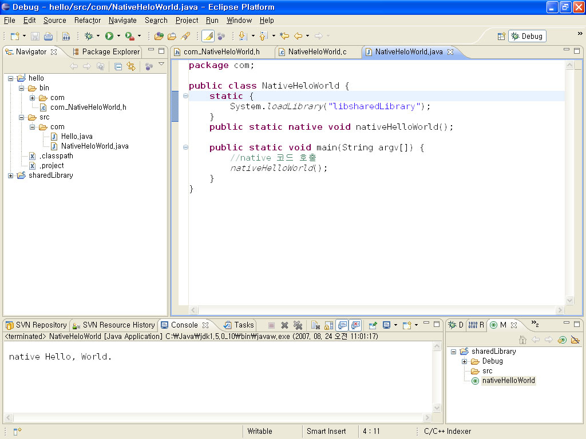
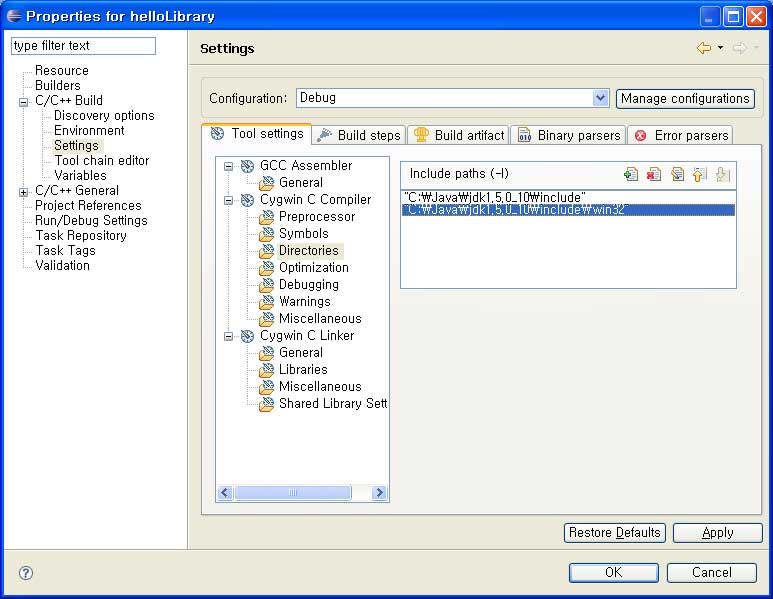

# native-c

eclipse에서 gcc를 이용해서 native dll 작성 및 사용
tistory에 올렸던것을 이전~~

#### 작성일
* 2007.8.24(티스토리 최초 작성일)
* 2011.3.11 약간수정

오래전부터 사용해왔고, 요즘은 아주 가끔 사용하는 visual c 6.0이 있는데, 요즘엔 1년에 몇번 쓸까 말까하고 기껏해야 java에서 사용하는 dll을 만드는 용도로 사용하다 보니, gcc를 사용하면 어떨까 싶어서 gclipse와 gcc를 사용하려는데, 환경은 windows라서 mingw를 사용합니다.

먼저 eclipse(http://www.eclipse.org)는 3.3  europa를 설치한뒤에 CDT를 추가설치를 하였다. 그리고 gcc 설치를 위해서 mingw(http://www.mingw.org/)를 다운받아 설치 합니다. 다운로드에 보면 소스포지에 연결되어 있는데 여기서 Automated MinGW Installer만 받아서 설치하면 필요한 파일을 자동으로 받아서 설치해준다. 설치 후에는 환경변수 path에 설치된 mingw의 bin 경로를 추가해준다. 다만 여기서 디버거는 설치해주지 않으므로 별도로 받아서 덮어쓰면 된다. 받을 파일은 GNU Source-Level Debugger이다.

이제 기본준비는 되었으며, java파일을 하나 만들고 gcc로 dll을 만들어서 사용해보자

1단계 java 프로젝트 생성

java프로젝트를 hello라고 하나 만든다. Hello.java 파일을 생성하고 Hello, World를 출력하는 코드를 만들어보자.

오래전에 C만든 사람이 쓴 책에 있는 그 유명한 Hello, World 되겠다. 그러면 여기서 native코드를 호출하는 class를 하나 만들어보자, 아래쪽에 native Hello, World가 보이는가, 이것이 목표입니다.

클래스내에 메소드를 선언할 때 native요거 들어간게 중요한거다, 이게 있어야 native를 사용할 수 있으며, static으로 정의되어 있는 내용은 class가 로딩될때 한번만 로딩하게 된다는 것이다. 이제 기본적인 것은 만들어 졌으니, C프로젝트를 시작할 준비를 해보자.

이제 C에서 사용되는 헤더파일을 작성해야 한다. 먼저 cmd창을 하나 열어서 hello 프로젝트가 있는 곳으로 가서 아래와 같이 한번 해보자..

D:projectjavagcchellobin>javah -jni com.HelloWorld

Exception in thread “main” java.lang.ClassFormatError: The major.minor version ‘

49.0’ is too recent for this tool to understand.

이런 당황스러운 환경이 된다면 컴파일된 java와 현재의 java의 버전이 안 맞아서 그런 것이다. 해결방법은 ? eclipse에서 지정된 jdk와 맞는 javah를 사용하면 된다.

현재 사용할  JDK의 버전에 맞는지 eclipse에서 확인하고 지정한다. PC에 1.4와 1.5 개의 버전이 있어 발생하는 문제이니, 1.5만 설치된 사용자는 아래의 그림처럼 자바 1.5 라이브러리만 지정하면 된다.

사용하는 자바를 1.5에 설정을 한다.

그리고 나서 정확한 jdk가 설치된 경로를 지정해서 아래와 같이 한다.

D:projectjavagcchellobin>c:javajdk1.5.0_10binjavah -jni com.HelloWorld

이제 헤더파일이 하나 만들어지는데 내용은 매우 단순하다. 그리고 나중에서 익숙해지면 javah를 사용하지 않고 그냥 만들어도 된다.

C/C++을 사용하신 분들은 친숙한 내용들이다.  이제 헤더파일이 만들어 졌으니 C프로젝트를 시작해보자.

C프로젝트를 선택하고 아래와 같이 지정한다.

project types에서 Shared Library을 선택하고, Toolchain에서는 MinGW를 선택하자.

이제 기본적인 준비는 되었으니, C코드를 만들어 보자, 먼저 앞서 정의한 com_HelloWorld.h파일을 src폴더를 하나 만든후에 C프로젝트로 복사한다. 파일이 많아지면 폴더를 구분하지만 여기서는 그냥 한곳에 작성한다.

이제 C함수를 하나 만들어보자.

정석대로 빌드를 하려면 makefile을 만들어서 해야하는데, makefile을 eclipse에서 간단하게 만들어보자.

Target Name: nativeHelloWorld

그리고 create 버튼을 눌러서 makefile을 생성한다. 나머지는 통과하고, 메뉴에서 windows/preferences…/Make/make targets view를 꺼내 본다. 그러면, make를 할 수 있는 화면이 아래와 같이 나온다.

컴파일을 한번 해보자. 큰 기대는 하지말고…

에러가 우수수 나와야 정상이다. 에러가 발생하는 원인은 include, library가 포함되지 않아서 발생하는 문제인데 이것을 추가해보자. java의 native와 관련된 헤더파일의 위치를 지정한다.

java native library 위치를 지정한다.

환경 설정이 끝났으면, 다시 build를 해보자. 음, 또 에러가 발생했다. 여기까지 똑같이 따라서 했으면 눈썰미 있는 분은 알겠지만 정작 필요한 헤더 파일이 include되지 않아서 발생하는 문제이다.

이상이 없다면 위와 같이 정상적으로 컴파일과, 링크가 되어서 libsharedLibrary.dll이라는 파일이 만들어 졌음을 알 수 있다, 상세한 내용은 Debug 부분을 보기 바란다. 안보이면 refresh를 하면 보인다. 지금까지 오다보니, java class 이름에 오타가 있네요...

여기서 유의할 사항이 하나 있는데, dll파일의 이름에 lib이라는 것이 추가되어 있는데, unix계열에서는 lib를 붙이는 것이 일반적이다. 이것은 프로젝트 속성에서 변경이 가능하다. 이름이 변경이 되면 호출하는 곳도 변경을 해줘야 한다.이제 NativeHeloWorld를 실행해보면 이런 에러가 나올 것이다.

ava.lang.UnsatisfiedLinkError: Expecting an absolute path of the library: libsharedLibrary
at java.lang.Runtime.load0(Runtime.java:766)
at java.lang.System.load(System.java:968)
at com.NativeHeloWorld.<clinit>(NativeHeloWorld.java:5)
Exception in thread “main”
libsharedLibrary를 로드 할 수 없다는 메세지인데, 이 문제를 해결하려면 windowssystem32에 복사하거나, java 폴더에 복사하는 방법이 있는데, 이런방법 보다는 실행할때 옵션을 주어서 찾는 방법을 사용해보자.

hello 프로젝트의 실행환경 설정에서  Run Dialog에서 아래와 같이 shared library파일이 있는 경로는 지정한다.

다시 한번 Hello를 실행해보자, 역시 에러다….

java.lang.UnsatisfiedLinkError: helloworld
at com.HelloWorld.helloworld(Native Method)
at com.Hello.main(Hello.java:8)

여기서 visual c로 만들었던 것과 비교를 해보니…함수명에 “_가 틀린것을 찾았는데, 아주 오래전에 이게 어떤 차이가 있다고 들은 기억이 있는데, C안쓴지 너무 오래되어 지금은 모르겠다, 아시면 알려주시라. 그래서 C함수명을 아래와 같이 수정했다.

Java_com_HelloWorld_helloworld ==>_Java_com_HelloWorld_helloworld
헤더파일도 함께 수정해한다. 그리고 다시 빌드해서 이상이 없으면 NativeHeloWorld을 실행해보자

native Hello, World.

여기까지가 windows환경에서 gcc와 java를 이용한 native의 기초입니다. 활용하는 방법은 상황에 맞게…끝.
